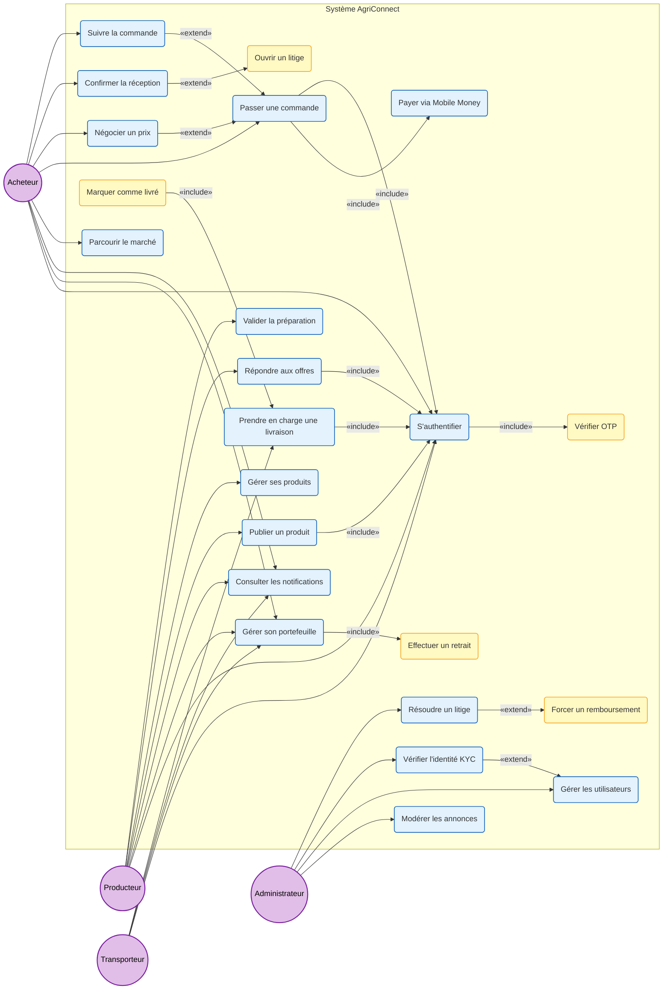

# Diagramme des Cas d'Utilisation

Ce diagramme illustre les interactions des différents acteurs (Acheteur, Producteur, Transporteur, et Administrateur) avec les fonctionnalités principales de la plateforme AgriConnect.

## 1. Diagramme 

---

## Relations clés expliquées

### Relations `«include»`
- **S'authentifier** inclut toujours **Vérifier OTP** (SMS obligatoire).
- **Gérer son portefeuille** inclut **Effectuer un retrait** (sous-flux bancaire obligatoire).
- **Passer une commande** inclut **Payer via Mobile Money** (paiement obligatoire) et **S'authentifier** (accès sécurisé requis).
- **Publier/Répondre à des offres/Prendre en charge une livraison** incluent tous **S'authentifier**.
- **Marquer comme livré** inclut **Prendre en charge une livraison** (pré-requis).

### Relations `«extend»`
- **Confirmer la réception** peut s'étendre vers **Ouvrir un litige** (si l'acheteur signale un problème).
- **Négocier un prix** étend **Passer une commande** (optionnel selon le producteur).
- **Suivre la commande** étend **Passer une commande** (fonctionnalité optionnelle de suivi).
- **Résoudre un litige** peut s'étendre vers **Forcer un remboursement** (décision admin).
- **Vérifier l'identité KYC** étend **Gérer les utilisateurs** (processus spécifique, non systématique).
---

## 2. Description des Cas d'Utilisation

###  L'Acheteur (Buyer)
C'est le demandeur principal sur le marché. Ses actions clés au sein du système sont :
- **Recherche & Filtrage** : Exploration libre ou via recherche par mots-clés du catalogue (Dashboard Marketplace).
- **Achat ou Négociation** : Décision d'acheter aux conditions listées ou d'engager une discussion via le chat P2P pour revoir le prix/les quantités en cas de transaction B2B.
- **Réception Commande** : Responsabilité de déclencher le déblocage des paiements (qui sont placés en compte séquestre lors de la validation), validant que la livraison s'est bien déroulée.

###  Le Producteur (Producer)
C'est l'offreur (souvent agricole). Ses interactions principales sont :
- **Catalogue Personnel** : Publication des offres, ajustement visuel des produits, définition de la quantité disponible et des contraintes (ex: Négociable ou non).
- **Gestion des offres** : Évaluation des propositions reçues via chat et conclusion sur le statut (Refus/Accord).
- **Logistique interne** : Notification du système de l'état d'avancement des préparations avant expédition.

###  Le Transporteur (Transporter)
Le maillon logistique vital à l'application. Ses capacités d'action :
- **Expédition** : Prise en responsabilité d'une commande `EN PRÉPARATION` pour la déplacer vers le statut `LIVRÉ`.
- (*Note : le système peut évoluer pour lui ajouter la consultation des Appels d'Offres de transport.*)

###  L'Administrateur (Admin)
Il assure le bon fonctionnement, la légalité et la modération du système global. 
- **Conformité & Modération** : Validation des profils sérieux (badges "Vérifié" / Processus KYC). Nettoyage des annonces frauduleuses.
- **Arbitrage des Litiges** : En cas de non-délivrance d'une marchandise validée par le client, l'administrateur prend la main pour décider du remboursement vers la balance de l'acheteur ou du déblocage forcé du compte séquestre vers le producteur. 
