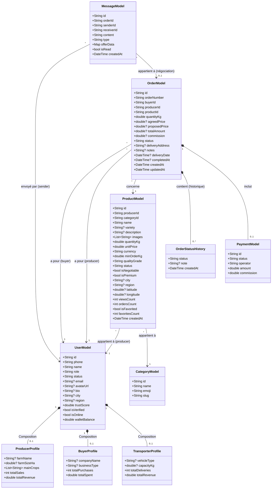

# Architecture & Diagramme de Classes (Mobile)

 le diagramme de classes pour l'application mobile AgriConnect.

## 1. Diagramme UML 

---

## 2. Description des Entités

###  Entité Utilisateur
Le cœur du système d'authentification et de rôles multicartes (Producteur, Acheteur, Transporteur). Il gère les données globales de l'utilisateur (nom, avatar, solde du portefeuille) et inclut par structure de composition 3 sous-profils spécifiques :
- **Profil Producteur** : Stocke les informations liées à son exploitation (surface, cultures, revenus).
- **Profil Acheteur** : Stocke sa typologie d'acheteur (type d'entreprise, total dépensé).
- **Profil Transporteur** : Stocke ses informations logistiques (type de véhicule, capacité, livraisons).

###  Entité Produit & Catégorie
Représente un produit physique mis en vente. 
Liaison clé : Il est lié à un Utilisateur (le producteur) et à une Catégorie (pour la structuration du catalogue).
Particularités : Gère les concepts de quantité minimale, de négociation (via son statut de négociabilité) et de grade de qualité (Trust Metrics).

###  Entité Commande
L'entité transactionnelle centrale.
- Lise un acheteur, un producteur et un produit.
- Est dotée d'une ligne de vie via son historique de statuts.
- Intègre explicitement un objet optionnel de Paiement si le cycle est facturé ou en séquestre.

###  Entité Message
Support de la communication directe ou contextuelle.
Particularité : Accepte des données d'offre optionnelles et un identifiant de commande optionnel. Si une négociation de gré-à-gré (pour une offre) aboutit, l'ordre de transaction complet qui en découle est généré tout en gardant cette trace.
